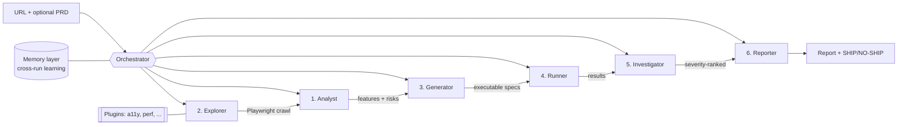

# AI QA Pipeline

[](https://github.com/nabeel-warraich/ai-qa-pipeline/actions/workflows/ci.yml)

**A vendor-agnostic, multi-agent AI QA pipeline.** Give it a URL (and, optionally, a
PRD). It walks the live app with Playwright like a real user, analyzes it, generates and
runs executable Playwright tests, and returns a **severity-ranked report with a
ship / no-ship verdict**.

Bring your own model — **OpenAI**, **Anthropic**, or run the built-in **heuristic mode with
no API key at all**. Your pipeline, your rules.

> **Scope & honesty:** this is a working **starter** (MVP), not a commercial product. It
> runs end-to-end today; the AI layer sharpens analysis and triage, while test generation
> stays deterministic and grounded in the real crawl (no hallucinated selectors). Built to
> be extended.

---

## Architecture



| # | Agent | Responsibility |
|---|-------|----------------|
| 1 | **Analyst** | Understands the app + PRD; extracts features, areas, risks, acceptance criteria |
| 2 | **Explorer** | Walks the live app with Playwright; captures structure, console errors, timing |
| 3 | **Generator** | Creates executable Playwright specs, grounded in the real crawl |
| 4 | **Runner** | Executes the generated specs; captures results (failures are data, not crashes) |
| 5 | **Investigator** | Triages failures, assigns severity, consults memory for regressions |
| 6 | **Reporter** | Builds the severity-ranked report and the ship / no-ship verdict |

**Cross-cutting:**
- **Memory layer** — persists selectors, bug history, and lessons to `.aiqa-memory.json` so each run builds on the last (no cold starts; recurring bugs are flagged as regressions).
- **Plugin ecosystem** — optional capabilities (accessibility, performance, and your own) plug in without touching the core. Ships with `a11y` and `perf`.
- **Vendor-agnostic LLM** — one `LLMProvider` interface; swap OpenAI / Anthropic / none.

---

## Quickstart

```bash
npm install
npx playwright install chromium

# Heuristic mode — no API key needed
npm run qa -- https://www.saucedemo.com --max-pages 3

# AI mode — copy .env.example to .env and set a provider + key
npm run qa -- https://example.com --provider anthropic --prd ./requirements.md
```

The report is written to `runs/<timestamp>/report.md` (and `report.json`).

### CLI options
| Flag | Description |
|------|-------------|
| `<url>` | Target to test (required) |
| `--provider` | `openai` \| `anthropic` \| `none` (default: `none`) |
| `--prd <file>` | Optional requirements file to steer analysis |
| `--max-pages N` | Crawl cap (default 5) |
| `--out <dir>` | Output directory |
| `--gate` | Exit non-zero on a **NO-SHIP** verdict (use as a CI quality gate) |

---

## Tech stack
Playwright · TypeScript · Node.js · OpenAI / Anthropic (optional) · GitHub Actions

## Built by
**Muhammad Nabeel Aslam** — Senior QA Engineer / Team Lead
[LinkedIn](https://www.linkedin.com/in/nabeel-warraich-178a65276) · nabeelaslamwarraich@gmail.com
